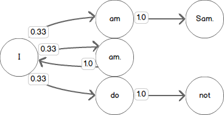
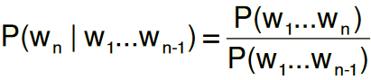
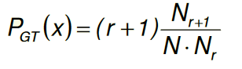
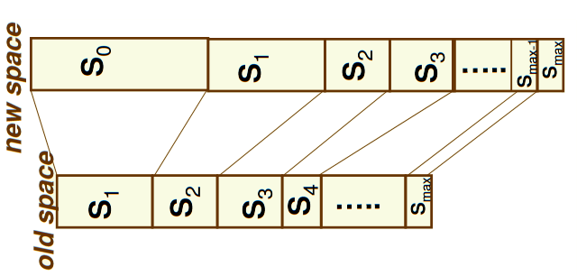

```{r setup, include=FALSE}
knitr::opts_chunk$set(echo = FALSE)
```

## Machine Learning on our lifes

Machine Learning (ML) is everywhere, when you use Netflix and they show you recomended movies or when you use Google translate.

One child of ML is the Natural Language Processing (NLP), this bracnch is used when you type in on the Google search bar or when you type on your smartphone keyboard.

NLP give us many benefits that we dodn't even realize.

## Word Predictor

On this project we bluid an NLP model that tries to predict the next word, this solution use the following concepts: 

- N-Gram
- Markov Chains
- Maximum Likelihood Estimation
- Good-Turning Frencuency

## N-Gram

Es a secuence of letters or word, they are named accordingly the number of elements.

For example we have this sentence: Thank you so much for your help. Let's apply diferent n-grams to the sentence 

- Unigram : 'Thank','you','so','much','for','your','help'
- Bigram : 'Thank you', 'you so','so much','much for','for your','your help'
- Trigram : 'Thank you so', 'you so much','so much for','much for your','for your help'


## Markov Chains


Are basically graphs, that have a state (word) and the links with the probablily for the next word.



We use the Markov Assumption, this means:

- Unigram: previous words do not matter
- Bigram: only the previous one word matters
- Trigram: only the previous two words matte

## Maximum Likelihood Estimation



As a example we calculate the probability of Unigrams using MLE:

P(Thank you so much for your help)
 
P(Thank|{Start}) x P(you|Thank) x P(so|you) x P(much|so) x P(for|much) x P(your|for) x P(help|your)

## Good-Turning Smoothing



Takes in consideration the probability of the unseen elements.



## Performance

We have 3,336,695 lines from tweets, blog and news using that we sample randomly 33,274 (0.1%) lines in total. 

Of the sample we use 60% for the trainig the model and 40% for testing.

The testing accuracy was X %.

## How to use the app

Steps:

 - Write text on the input located on the top right. 
 - Presss the predict button.

Output: 

 - Displays 3 predictions.
 - Graph with the top 10 words with the higher probaility.
 - Text inserted on top right.

## Links

- Text and n-gram analysis: https://rpubs.com/alexsb95/582863
- App: https://alexsb95.shinyapps.io/NLP_Word_Predictor/

